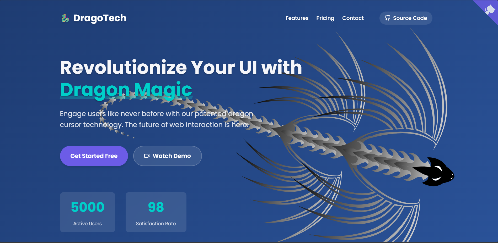

# 🐉 DragoTech - Interactive Dragon Cursor

**DragoTech** is a revolutionary user interface enhancement that introduces a dynamic, interactive **dragon cursor** to your website. Designed to mesmerize users and elevate engagement, this lightweight solution transforms your cursor into a magical experience.



---

## 🚀 Live Demo

🔗 [Check out the live demo](https://sfmn2p.csb.app/)

---

## ✨ Features

- 🐲 **Immersive Experience**: Transform the browsing experience with a magical dragon that follows your cursor.
- ⚡ **Lightning Fast**: Built with pure SVG and minimal JavaScript (~15KB). No external libraries.
- 🎨 **Fully Customizable**: Modify dragon styles, colors, animations, and interactivity with ease.
- 🌐 **Responsive Design**: Works seamlessly on both desktop and mobile devices.
- 🔗 **GitHub Corner Ribbon**: Quickly access source code from any page.

---

## 📁 Project Structure

```bash
.
├── index.html          # Main HTML file
├── styles.css          # All custom styles and animations
├── script.js           # Dragon logic and interactivity
└── assets/             # (Optional) Images or other assets
